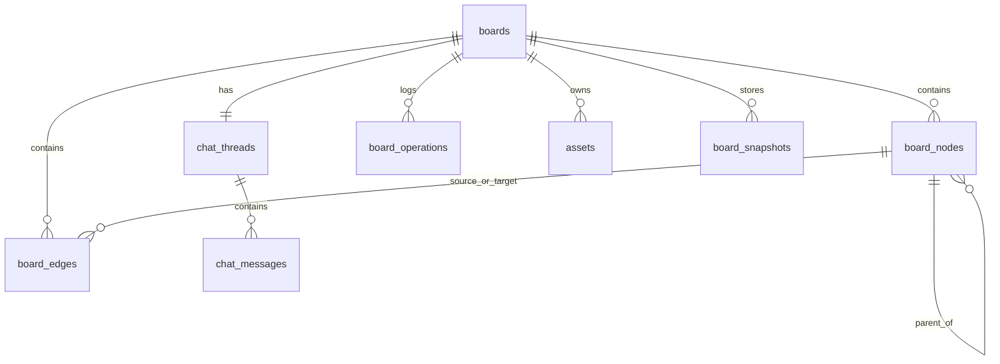

# Context Board MVP — Data Model

## 1. Goals

This document defines the persistent data model for the Context Board MVP.

The model is designed for:
- single-user usage
- one board = one chat thread
- PostgreSQL as source of truth
- relational core + JSONB payloads
- append-only operations log
- AI suggest/apply edit flow
- future migration path to multi-user without redesigning core tables

---

## 2. Design Principles

## 2.1 Relational skeleton + JSONB payloads

Use normal relational columns for:
- identifiers
- foreign keys
- geometry
- ordering
- durable flags
- timestamps
- revisioning

Use `jsonb` for:
- flexible node content
- style payloads
- metadata
- board settings
- selection context
- AI summaries
- operation payload details

This keeps the database queryable and strict where it matters, while still flexible for evolving UI and AI features.

## 2.2 Structured board state

The board is **not** stored as a single opaque JSON blob as the primary durable model.

Primary durable state is split into:
- `boards`
- `board_nodes`
- `board_edges`
- `chat_threads`
- `chat_messages`
- `board_operations`
- `assets`

Optional:
- `board_snapshots`
- `idempotency_keys`

## 2.3 Operation-first mutation model

All durable mutations must be represented as operations.
This includes user edits and AI-applied edits.

## 2.4 Revision-based sync

Each board has a monotonically increasing `revision`.
Every successful durable mutation increments that revision exactly once.

This gives the frontend a stable sync primitive even before realtime support exists.

---

## 3. Entity List

MVP entities:

- `boards`
- `board_nodes`
- `board_edges`
- `board_operations`
- `assets`
- `chat_threads`
- `chat_messages`
- `board_snapshots` (recommended)
- `idempotency_keys` (recommended)

---

## 4. Mermaid ERD



---

## 5. Enumerations

## 5.1 BoardStatus
- `active`
- `archived`
- `deleted`

## 5.2 NodeType
- `sticky`
- `text`
- `image`
- `shape`

## 5.3 OperationActorType
- `user`
- `agent`
- `system`

## 5.4 OperationTargetType
- `board`
- `node`
- `edge`
- `asset`
- `chat`
- `layout`
- `snapshot`

## 5.5 OperationType
- `create_node`
- `update_node`
- `delete_node`
- `restore_node`
- `create_edge`
- `update_edge`
- `delete_edge`
- `create_asset`
- `update_board`
- `apply_agent_action_batch`
- `create_snapshot`

## 5.6 AssetKind
- `image`
- `file`

## 5.7 AssetProcessingStatus
- `pending`
- `processing`
- `ready`
- `failed`

## 5.8 ChatSenderType
- `user`
- `agent`
- `system`

## 5.9 SnapshotType
- `manual`
- `autosave`
- `before_ai_apply`

---

## 6. Schema Overview

## 6.1 boards

Represents one visual board.

### Fields
- `id` — UUID primary key
- `title` — board title
- `description` — optional text
- `status` — enum-like text
- `viewport_state` — JSONB
- `settings` — JSONB
- `summary` — JSONB
- `revision` — bigint, increments on every durable board mutation
- `created_at`
- `updated_at`

### Responsibilities
- stores board-level settings
- stores initial/default viewport
- acts as sync root for all board entities

---

## 6.2 board_nodes

Represents visual objects on the board.

### Fields
- `id`
- `board_id`
- `type`
- `parent_id` nullable
- `x`
- `y`
- `width`
- `height`
- `rotation`
- `z_index`
- `content` JSONB
- `style` JSONB
- `metadata` JSONB
- `locked`
- `hidden`
- `deleted_at`
- `created_at`
- `updated_at`

### Responsibilities
- stores all visible board objects
- stores geometry separately from content
- supports soft delete
- supports future grouping via `parent_id` or metadata

---

## 6.3 board_edges

Represents connectors between nodes.

### Fields
- `id`
- `board_id`
- `source_node_id`
- `target_node_id`
- `label`
- `style` JSONB
- `metadata` JSONB
- `deleted_at`
- `created_at`
- `updated_at`

### Responsibilities
- expresses relationships between nodes
- enables flow/diagram style usage
- supports soft delete

---

## 6.4 board_operations

Append-only mutation log.

### Fields
- `id`
- `board_id`
- `board_revision`
- `actor_type`
- `operation_type`
- `target_type`
- `target_id` nullable
- `batch_id` nullable
- `payload` JSONB
- `inverse_payload` JSONB nullable
- `created_at`

### Responsibilities
- audit trail
- undo foundation
- sync feed foundation
- AI mutation traceability

---

## 6.5 assets

Uploaded files, mostly images in MVP.

### Fields
- `id`
- `board_id` nullable
- `kind`
- `mime_type`
- `original_filename`
- `storage_key`
- `file_size_bytes`
- `width`
- `height`
- `processing_status`
- `extracted_text`
- `ai_caption`
- `metadata` JSONB
- `created_at`
- `updated_at`

### Responsibilities
- durable link between uploaded file and board content
- backing store for image nodes
- future OCR/captioning support

---

## 6.6 chat_threads

One per board in MVP.

### Fields
- `id`
- `board_id` unique
- `metadata` JSONB
- `created_at`
- `updated_at`

### Responsibilities
- stable container for board chat
- allows future expansion to multiple threads later

---

## 6.7 chat_messages

Messages inside a board’s chat thread.

### Fields
- `id`
- `thread_id`
- `sender_type`
- `message_text`
- `message_json` JSONB
- `selection_context` JSONB
- `created_at`

### Responsibilities
- stores board-related chat history
- stores optional structured action plans
- stores selection/viewport context for user requests

---

## 6.8 board_snapshots

Optional but strongly recommended.

### Fields
- `id`
- `board_id`
- `board_revision`
- `snapshot_type`
- `snapshot_data` JSONB
- `created_at`

### Responsibilities
- restore point before destructive or large AI changes
- autosave checkpoints
- debug/audit tooling

---

## 6.9 idempotency_keys

Recommended for production-grade mutation handling.

### Fields
- `id`
- `scope_key`
- `request_fingerprint`
- `response_status_code`
- `response_body` JSONB
- `created_at`
- `expires_at`

### Responsibilities
- deduplicate retried POST/PATCH requests
- return stored response for same idempotent request replay

---

## 7. PostgreSQL DDL

## 7.1 boards

```sql
create table boards (
  id uuid primary key,
  title text not null default 'Untitled board',
  description text,
  status text not null default 'active',
  viewport_state jsonb not null default '{}'::jsonb,
  settings jsonb not null default '{}'::jsonb,
  summary jsonb not null default '{}'::jsonb,
  revision bigint not null default 0,
  created_at timestamptz not null default now(),
  updated_at timestamptz not null default now(),

  constraint boards_status_check
    check (status in ('active', 'archived', 'deleted'))
);

create index idx_boards_status on boards(status);
create index idx_boards_updated_at on boards(updated_at desc);
```

---

## 7.2 board_nodes

```sql
create table board_nodes (
  id uuid primary key,
  board_id uuid not null references boards(id) on delete cascade,
  type text not null,
  parent_id uuid references board_nodes(id) on delete set null,

  x double precision not null default 0,
  y double precision not null default 0,
  width double precision not null default 200,
  height double precision not null default 120,
  rotation double precision not null default 0,
  z_index integer not null default 0,

  content jsonb not null default '{}'::jsonb,
  style jsonb not null default '{}'::jsonb,
  metadata jsonb not null default '{}'::jsonb,

  locked boolean not null default false,
  hidden boolean not null default false,
  deleted_at timestamptz,

  created_at timestamptz not null default now(),
  updated_at timestamptz not null default now(),

  constraint board_nodes_type_check
    check (type in ('sticky', 'text', 'image', 'shape')),
  constraint board_nodes_width_check
    check (width > 0 and width <= 10000),
  constraint board_nodes_height_check
    check (height > 0 and height <= 10000)
);

create index idx_board_nodes_board_id on board_nodes(board_id);
create index idx_board_nodes_parent_id on board_nodes(parent_id);
create index idx_board_nodes_board_z on board_nodes(board_id, z_index);
create index idx_board_nodes_not_deleted on board_nodes(board_id) where deleted_at is null;
create index idx_board_nodes_type on board_nodes(board_id, type);
create index idx_board_nodes_content_gin on board_nodes using gin (content);
create index idx_board_nodes_metadata_gin on board_nodes using gin (metadata);
```

---

## 7.3 board_edges

```sql
create table board_edges (
  id uuid primary key,
  board_id uuid not null references boards(id) on delete cascade,
  source_node_id uuid not null references board_nodes(id) on delete cascade,
  target_node_id uuid not null references board_nodes(id) on delete cascade,

  label text,
  style jsonb not null default '{}'::jsonb,
  metadata jsonb not null default '{}'::jsonb,

  deleted_at timestamptz,
  created_at timestamptz not null default now(),
  updated_at timestamptz not null default now(),

  constraint board_edges_no_self_loop_check
    check (source_node_id <> target_node_id)
);

create index idx_board_edges_board_id on board_edges(board_id);
create index idx_board_edges_source_node_id on board_edges(source_node_id);
create index idx_board_edges_target_node_id on board_edges(target_node_id);
create index idx_board_edges_not_deleted on board_edges(board_id) where deleted_at is null;
```

---

## 7.4 board_operations

```sql
create table board_operations (
  id uuid primary key,
  board_id uuid not null references boards(id) on delete cascade,
  board_revision bigint not null,
  actor_type text not null,
  operation_type text not null,
  target_type text not null,
  target_id uuid,
  batch_id uuid,
  payload jsonb not null,
  inverse_payload jsonb,
  created_at timestamptz not null default now(),

  constraint board_operations_actor_type_check
    check (actor_type in ('user', 'agent', 'system')),
  constraint board_operations_target_type_check
    check (target_type in ('board', 'node', 'edge', 'asset', 'chat', 'layout', 'snapshot'))
);

create index idx_board_operations_board_revision on board_operations(board_id, board_revision);
create index idx_board_operations_board_created on board_operations(board_id, created_at);
create index idx_board_operations_batch_id on board_operations(batch_id);
create index idx_board_operations_target on board_operations(target_type, target_id);
```

---

## 7.5 assets

```sql
create table assets (
  id uuid primary key,
  board_id uuid references boards(id) on delete set null,
  kind text not null,
  mime_type text,
  original_filename text,
  storage_key text not null unique,
  file_size_bytes bigint,
  width integer,
  height integer,
  processing_status text not null default 'ready',
  extracted_text text,
  ai_caption text,
  metadata jsonb not null default '{}'::jsonb,
  created_at timestamptz not null default now(),
  updated_at timestamptz not null default now(),

  constraint assets_kind_check
    check (kind in ('image', 'file')),
  constraint assets_processing_status_check
    check (processing_status in ('pending', 'processing', 'ready', 'failed'))
);

create index idx_assets_board_id on assets(board_id);
create index idx_assets_kind on assets(kind);
create index idx_assets_processing_status on assets(processing_status);
```

---

## 7.6 chat_threads

```sql
create table chat_threads (
  id uuid primary key,
  board_id uuid not null unique references boards(id) on delete cascade,
  metadata jsonb not null default '{}'::jsonb,
  created_at timestamptz not null default now(),
  updated_at timestamptz not null default now()
);
```

---

## 7.7 chat_messages

```sql
create table chat_messages (
  id uuid primary key,
  thread_id uuid not null references chat_threads(id) on delete cascade,
  sender_type text not null,
  message_text text,
  message_json jsonb not null default '{}'::jsonb,
  selection_context jsonb not null default '{}'::jsonb,
  created_at timestamptz not null default now(),

  constraint chat_messages_sender_type_check
    check (sender_type in ('user', 'agent', 'system'))
);

create index idx_chat_messages_thread_created on chat_messages(thread_id, created_at);
create index idx_chat_messages_sender_type on chat_messages(sender_type);
```

---

## 7.8 board_snapshots

```sql
create table board_snapshots (
  id uuid primary key,
  board_id uuid not null references boards(id) on delete cascade,
  board_revision bigint not null,
  snapshot_type text not null,
  snapshot_data jsonb not null,
  created_at timestamptz not null default now(),

  constraint board_snapshots_type_check
    check (snapshot_type in ('manual', 'autosave', 'before_ai_apply'))
);

create index idx_board_snapshots_board_revision on board_snapshots(board_id, board_revision desc);
create index idx_board_snapshots_board_created on board_snapshots(board_id, created_at desc);
```

---

## 7.9 idempotency_keys

```sql
create table idempotency_keys (
  id uuid primary key,
  scope_key text not null unique,
  request_fingerprint text not null,
  response_status_code integer not null,
  response_body jsonb not null,
  created_at timestamptz not null default now(),
  expires_at timestamptz not null
);

create index idx_idempotency_keys_expires_at on idempotency_keys(expires_at);
```

---

## 8. Field Shape Conventions

## 8.1 boards.viewport_state

Example:

```json
{
  "x": 0,
  "y": 0,
  "zoom": 1
}
```

Rules:
- `zoom > 0`
- client may persist most recent viewport
- not used as collaborative cursor state

## 8.2 boards.settings

Example:

```json
{
  "gridEnabled": true,
  "snapToGrid": false,
  "agentEditMode": "suggest"
}
```

Rules:
- unknown keys allowed
- UI-only ephemeral state should not be stored here

## 8.3 boards.summary

Example:

```json
{
  "text": "Research board for travel app",
  "updatedAt": "2026-03-15T20:00:00.000Z"
}
```

Rules:
- optional
- may be AI-generated
- not used as source of truth

---

## 9. Node Content Rules

## 9.1 sticky node

Example:

```json
{
  "text": "Users want to share itineraries"
}
```

Required:
- `text` string

Max:
- 20,000 chars

## 9.2 text node

Example:

```json
{
  "title": "Research notes",
  "text": "Longer freeform text"
}
```

Required:
- `text` string

Optional:
- `title`

## 9.3 image node

Example:

```json
{
  "assetId": "uuid",
  "caption": "Reference screenshot"
}
```

Required:
- `assetId`

Optional:
- `caption`

Invariant:
- referenced asset must exist
- asset kind should be `image` for image nodes

## 9.4 shape node

Example:

```json
{
  "shapeType": "rectangle",
  "text": "Step 1"
}
```

Required:
- `shapeType`

Allowed `shapeType` in MVP:
- `rectangle`
- `ellipse`
- `diamond`

Optional:
- `text`

---

## 10. Style and Metadata Rules

## 10.1 style

`style` is display-oriented, not semantic.

Example:

```json
{
  "backgroundColor": "#FFF59D",
  "textColor": "#111111",
  "fontSize": 16,
  "borderColor": "#E0E0E0"
}
```

Rules:
- unknown keys allowed
- invalid style keys should be rejected only if obviously malformed
- arrays inside style are allowed but replaced whole on merge patch

## 10.2 metadata

`metadata` is machine- and app-oriented.

Example:

```json
{
  "groupId": "uuid-group-1",
  "aiGenerated": true,
  "tags": ["research"]
}
```

Rules:
- unknown keys allowed
- metadata must not be required for interpretation of core object identity
- metadata should not duplicate geometry or relations already modeled in columns

---

## 11. Lifecycle Rules

## 11.1 Board lifecycle

States:
- `active`
- `archived`
- `deleted`

Behavior:
- active boards are fully editable
- archived boards are read-only unless explicitly restored
- deleted boards are not returned in normal board listing

MVP recommendation:
- `DELETE /boards/:boardId` sets status to `deleted`
- hard delete is optional admin/dev cleanup only

## 11.2 Node lifecycle

States:
- active (`deleted_at is null`)
- soft-deleted (`deleted_at is not null`)

Behavior:
- active nodes are returned in normal state responses
- deleted nodes are excluded by default
- restoring a node clears `deleted_at`

## 11.3 Edge lifecycle

Same as node lifecycle.

Behavior:
- if a connected node is deleted, connected edges should also be soft-deleted in same transaction
- new edges cannot reference deleted nodes

## 11.4 Asset lifecycle

States:
- processing lifecycle via `processing_status`
- asset may remain even if referencing node is deleted

Behavior:
- deleting an image node does not automatically delete the asset file in MVP
- file cleanup can be handled later

## 11.5 Chat lifecycle

- a chat thread is created automatically when a board is created
- thread is unique per board
- chat messages are append-only

## 11.6 Snapshot lifecycle

- snapshot may be created before large AI apply
- snapshots are immutable after creation

---

## 12. Invariants

These must always hold.

## 12.1 Board invariants
- every node belongs to exactly one board
- every edge belongs to exactly one board
- every board has exactly one chat thread in MVP
- board revision is monotonic and never decreases

## 12.2 Node invariants
- width and height must be positive
- type must be one of supported node types
- parent node, if present, must belong to same board
- image node content must reference existing asset

## 12.3 Edge invariants
- source and target node must exist
- source and target must belong to same board as edge
- source and target cannot be equal
- deleted nodes cannot be used in new edge creation

## 12.4 Chat invariants
- each message belongs to exactly one thread
- each thread belongs to exactly one board
- selection context, if stored, must be JSON object

## 12.5 Operation invariants
- every durable mutation appends at least one operation row
- all operations for one committed mutation batch share same `board_revision`
- a board revision corresponds to one committed logical mutation batch

---

## 13. Validation Rules

## 13.1 Common validation
- all ids are UUIDs
- timestamps are generated by server
- server rejects unknown enum values
- strings longer than max allowed cause validation error
- invalid JSON shape in structured fields causes validation error

## 13.2 Board validation
- title length: 1 to 200 chars
- description length: 0 to 10,000 chars
- status must be valid enum
- viewport_state must be object

## 13.3 Node validation
- type required on create
- `x`, `y`, `width`, `height` required on create
- width and height > 0
- width and height <= 10,000
- rotation between -360 and 360 recommended
- locked nodes cannot be updated except by system restore/admin path
- hidden is boolean
- content must satisfy type-specific requirements

## 13.4 Edge validation
- source and target ids required on create
- source and target must exist
- source and target must belong to same board
- no self-loop in MVP

## 13.5 Asset validation
- file size must be <= configured limit
- mime type must be allowed
- image dimensions may be nullable until processing completes

## 13.6 Chat validation
- message text max 20,000 chars
- either message_text or structured message_json content should exist
- selection_context must be object if present

---

## 14. Operations Model

## 14.1 Why operations exist

Operations are durable records of intent + effect.
They are required for:
- auditing
- agent safety
- sync
- undo foundations
- debugging

## 14.2 One revision per committed mutation batch

A single logical mutation batch:
- increments board revision once
- writes one or more operations with same `board_revision`
- commits in one transaction

Examples:
- moving one node: one revision
- batch layout of 12 nodes: one revision
- applying AI plan with 3 creates + 4 updates: one revision

## 14.3 Example operation payloads

### create_node

```json
{
  "node": {
    "id": "uuid",
    "type": "sticky",
    "x": 100,
    "y": 120,
    "width": 240,
    "height": 120,
    "content": { "text": "New note" }
  }
}
```

### update_node

```json
{
  "before": {
    "x": 100,
    "y": 120,
    "content": { "text": "Old text" }
  },
  "after": {
    "x": 180,
    "y": 200,
    "content": { "text": "Updated text" }
  }
}
```

### delete_edge

```json
{
  "edgeId": "uuid"
}
```

### apply_agent_action_batch

```json
{
  "sourceMessageId": "uuid",
  "actionCount": 5
}
```

---

## 15. Patch Semantics

## 15.1 PATCH uses JSON Merge Patch semantics

For partial updates:
- objects merge recursively
- `null` deletes a key
- arrays replace fully
- unspecified keys stay unchanged

Example:

Existing `metadata`:
```json
{
  "groupId": "g1",
  "tags": ["a", "b"]
}
```

Patch:
```json
{
  "metadata": {
    "groupId": "g2"
  }
}
```

Result:
```json
{
  "groupId": "g2",
  "tags": ["a", "b"]
}
```

Patch:
```json
{
  "metadata": {
    "tags": ["c"]
  }
}
```

Result:
```json
{
  "groupId": "g1",
  "tags": ["c"]
}
```

Patch:
```json
{
  "metadata": {
    "groupId": null
  }
}
```

Result:
```json
{
  "tags": ["a", "b"]
}
```

## 15.2 Partial update behavior
- scalar fields overwrite
- objects merge
- arrays replace whole
- sending `null` to nullable scalar column-backed field may clear it only if API allows clearing that field

---

## 16. Batch Semantics

## 16.1 Atomicity
All batch mutation endpoints are atomic.

If any operation in a batch fails:
- no state is committed
- no board revision increments
- no partial operations log persists

## 16.2 Ordering
Operations in a batch are processed in order provided.

## 16.3 Temp ids
Batch create may use client temp ids for response mapping.

## 16.4 Recommended max batch size
- max 200 operations per batch in MVP

---

## 17. Idempotency Model

## 17.1 Supported endpoints
Recommended for:
- create board
- create node
- batch node mutation
- create edge
- upload finalize step
- apply agent actions

## 17.2 Scope key construction
Server may store unique scope key per:
- HTTP method
- path
- idempotency key

Example:
`POST:/api/boards/abc/nodes:client-key-123`

## 17.3 Fingerprint
Store a fingerprint/hash of:
- method
- path
- normalized request body

If same key is reused with different payload:
- return conflict/idempotency mismatch error

## 17.4 Expiry
Recommended idempotency retention:
- 24 hours

---

## 18. Indexing Strategy

## 18.1 Core B-tree indexes
Use B-tree for:
- board foreign keys
- timestamps
- revision scans
- uniqueness constraints

## 18.2 JSONB GIN indexes
Use GIN indexes only where query patterns justify them.

Recommended:
- `board_nodes.content`
- `board_nodes.metadata`

Use cautiously:
- `boards.settings`
- `assets.metadata`

## 18.3 Partial indexes
Use partial indexes for active rows:
- nodes where `deleted_at is null`
- edges where `deleted_at is null`

This keeps common board-state queries fast.

---

## 19. Common Query Patterns

## 19.1 Hydrate full board state

```sql
select * from boards where id = $1 and status <> 'deleted';

select * from board_nodes
where board_id = $1 and deleted_at is null
order by z_index asc, created_at asc;

select * from board_edges
where board_id = $1 and deleted_at is null
order by created_at asc;

select * from chat_threads where board_id = $1;
```

## 19.2 Fetch messages

```sql
select * from chat_messages
where thread_id = $1
order by created_at asc
limit 200;
```

## 19.3 Poll operations after revision

```sql
select * from board_operations
where board_id = $1 and board_revision > $2
order by board_revision asc, created_at asc;
```

## 19.4 Viewport filtering later

```sql
select * from board_nodes
where board_id = $1
  and deleted_at is null
  and x < $viewport_right
  and x + width > $viewport_left
  and y < $viewport_bottom
  and y + height > $viewport_top;
```

---

## 20. Recommended Transaction Flows

## 20.1 Create node
Inside one transaction:
1. validate board exists and editable
2. insert node
3. increment board revision
4. insert `create_node` operation with new revision
5. update board `updated_at`

## 20.2 Delete node
Inside one transaction:
1. validate node exists and editable
2. soft-delete node
3. soft-delete connected edges
4. increment board revision
5. write operation rows
6. update board `updated_at`

## 20.3 Apply AI action batch
Inside one transaction:
1. validate board editable
2. validate all action plan items
3. optionally create snapshot
4. apply all changes
5. increment board revision once
6. insert all operation rows with same revision/batch id
7. update board `updated_at`

---

## 21. Concurrency Strategy

For MVP single-user mode:
- standard transaction consistency is sufficient

Recommended future-safe approach:
- mutation transaction may use per-board transaction advisory lock
- board revision acts as optimistic sync token

This allows future migration to multi-user without redesigning the model.

---

## 22. Limits

Recommended MVP limits:

- board title: 200 chars
- board description: 10,000 chars
- text per node: 20,000 chars
- chat message: 20,000 chars
- max node width/height: 10,000
- max nodes per board soft limit: 5,000
- max edges per board soft limit: 10,000
- max batch operations: 200
- max upload size:
  - image: 20 MB
  - file: 50 MB

These are implementation limits, not permanent product limits.

---

## 23. Snapshot Strategy

Recommended snapshot triggers:
- before AI apply with more than N actions
- before destructive bulk delete
- autosave every major milestone

Snapshot data should include:
- board record subset
- active nodes
- active edges
- optional chat reference only, not full chat duplication

Snapshots are not source of truth.
They are restore aids.

---

## 24. Migration Path to Multi-User

This model is intentionally compatible with future multi-user support.

Later additions can include:
- `users`
- `board_memberships`
- `created_by_user_id`
- `updated_by_user_id`
- `author_user_id` on operations/messages
- permission checks
- optimistic concurrency via `If-Match` / revision check

Because the current model already has:
- stable ids
- operation log
- revisioning
- separate chat thread
- structured board entities

the multi-user migration should be additive rather than destructive.

---

## 25. Final Notes

The most important modeling decisions are:

1. board state is structured, not blob-first
2. flexible payloads live in JSONB, not everything
3. every durable mutation produces an operation
4. board revision is the sync primitive
5. AI edits are validated batches, not direct writes

If those five rules are preserved, the rest of the system can evolve safely.
