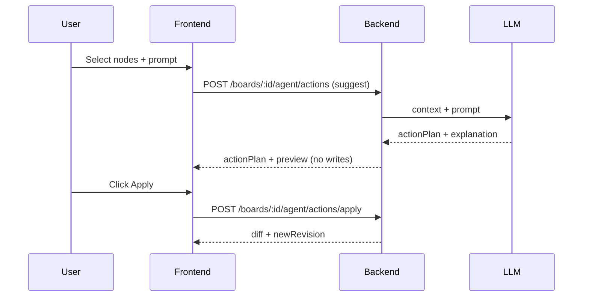

# examples.md

This document provides canonical JSON examples for the **single-user visual context board MVP** API, focusing on shapes that engineers can copy into tests, docs, or stubs. It standardizes partial updates via **JSON Merge Patch** and positions **OpenAPI 3.1** as the contract source for typed clients and schema-driven tests.

## Assumptions (MVP limits)

- Max nodes per board: **5000**
- Max batch ops per request: **200**
- Max upload image size: **20MB**
- Max text length per node: **20,000 chars**
- LLM max tokens: **8k** (truncate to ~**6k** tokens for content fields)

Patch semantics:
- `PATCH` uses **application/merge-patch+json** per JSON Merge Patch rules (objects merge; `null` removes keys; arrays are replaced).

## Example catalog

| Example | Purpose |
|---|---|
| Board | Canonical board metadata and sync revision |
| Node (sticky/text/image/shape) | Canonical node variants with content rules |
| Edge | Canonical connector between nodes |
| Asset upload response | Upload result including URLs and processing status |
| ChatMessage (user/agent) | Chat persistence with selection context + agent payload |
| ActionPlan items | Canonical agent edit primitives |
| Batch (tempIds) | Atomic multi-op request + tempId → id mapping |
| Agent suggest response | Previewable plan; no DB writes |
| Agent apply request/response | Validated atomic apply returning diffs |

## Canonical entity examples

### Board

```json
{
  "id": "11111111-1111-1111-1111-111111111111",
  "title": "Travel app brainstorm",
  "description": "Ideas and flows",
  "status": "active",
  "revision": 12,
  "viewportState": { "x": 0, "y": 0, "zoom": 1 },
  "settings": { "gridEnabled": true, "snapToGrid": false, "agentEditMode": "suggest" },
  "summary": { "text": "Brainstorm board for MVP", "updatedAt": "2026-03-15T22:10:00Z" },
  "createdAt": "2026-03-15T21:00:00Z",
  "updatedAt": "2026-03-15T22:10:05Z"
}
```

### Node: sticky

```json
{
  "id": "aaaaaaaa-aaaa-aaaa-aaaa-aaaaaaaaaaaa",
  "boardId": "11111111-1111-1111-1111-111111111111",
  "type": "sticky",
  "parentId": null,
  "x": 100,
  "y": 120,
  "width": 240,
  "height": 120,
  "rotation": 0,
  "zIndex": 10,
  "content": { "text": "Users want to share itineraries" },
  "style": { "backgroundColor": "#FFF59D" },
  "metadata": { "aiGenerated": false, "tags": ["insight"] },
  "locked": false,
  "hidden": false,
  "createdAt": "2026-03-15T21:40:00Z",
  "updatedAt": "2026-03-15T21:40:00Z"
}
```

### Node: text

```json
{
  "id": "bbbbbbbb-bbbb-bbbb-bbbb-bbbbbbbbbbbb",
  "boardId": "11111111-1111-1111-1111-111111111111",
  "type": "text",
  "parentId": null,
  "x": 420,
  "y": 120,
  "width": 440,
  "height": 360,
  "rotation": 0,
  "zIndex": 11,
  "content": { "title": "Research notes", "text": "Longer text content..." },
  "style": { "fontSize": 14 },
  "metadata": { "aiGenerated": false },
  "locked": false,
  "hidden": false,
  "createdAt": "2026-03-15T21:42:00Z",
  "updatedAt": "2026-03-15T21:43:10Z"
}
```

### Node: image

```json
{
  "id": "cccccccc-cccc-cccc-cccc-cccccccccccc",
  "boardId": "11111111-1111-1111-1111-111111111111",
  "type": "image",
  "parentId": null,
  "x": 100,
  "y": 300,
  "width": 360,
  "height": 240,
  "rotation": 0,
  "zIndex": 12,
  "content": { "assetId": "dddddddd-dddd-dddd-dddd-dddddddddddd", "caption": "Reference screenshot" },
  "style": {},
  "metadata": {},
  "locked": false,
  "hidden": false,
  "createdAt": "2026-03-15T21:50:00Z",
  "updatedAt": "2026-03-15T21:50:00Z"
}
```

### Node: shape

```json
{
  "id": "eeeeeeee-eeee-eeee-eeee-eeeeeeeeeeee",
  "boardId": "11111111-1111-1111-1111-111111111111",
  "type": "shape",
  "parentId": null,
  "x": 560,
  "y": 520,
  "width": 240,
  "height": 140,
  "rotation": 0,
  "zIndex": 13,
  "content": { "shapeType": "diamond", "text": "Decision?" },
  "style": { "borderColor": "#333333" },
  "metadata": {},
  "locked": false,
  "hidden": false,
  "createdAt": "2026-03-15T21:55:00Z",
  "updatedAt": "2026-03-15T21:55:00Z"
}
```

### Edge

```json
{
  "id": "ffffffff-ffff-ffff-ffff-ffffffffffff",
  "boardId": "11111111-1111-1111-1111-111111111111",
  "sourceNodeId": "aaaaaaaa-aaaa-aaaa-aaaa-aaaaaaaaaaaa",
  "targetNodeId": "eeeeeeee-eeee-eeee-eeee-eeeeeeeeeeee",
  "label": "leads to",
  "style": { "lineStyle": "solid" },
  "metadata": {},
  "createdAt": "2026-03-15T22:00:00Z",
  "updatedAt": "2026-03-15T22:00:00Z"
}
```

## Asset upload response

```json
{
  "data": {
    "asset": {
      "id": "dddddddd-dddd-dddd-dddd-dddddddddddd",
      "boardId": "11111111-1111-1111-1111-111111111111",
      "kind": "image",
      "mimeType": "image/png",
      "originalFilename": "screenshot.png",
      "storageKey": "assets/2026/03/15/dddd.../original.png",
      "url": "/api/assets/dddddddd-dddd-dddd-dddd-dddddddddddd/file",
      "thumbnailUrl": "/api/assets/dddddddd-dddd-dddd-dddd-dddddddddddd/thumbnail",
      "fileSizeBytes": 523412,
      "width": 1280,
      "height": 720,
      "processingStatus": "ready",
      "extractedText": null,
      "aiCaption": null,
      "metadata": {},
      "createdAt": "2026-03-15T21:49:30Z",
      "updatedAt": "2026-03-15T21:49:30Z"
    }
  },
  "error": null
}
```

## Chat messages

### ChatMessage (user)

```json
{
  "id": "99999999-9999-9999-9999-999999999999",
  "threadId": "22222222-2222-2222-2222-222222222222",
  "senderType": "user",
  "messageText": "Group selected notes into themes and propose a clean layout.",
  "messageJson": {},
  "selectionContext": {
    "selectedNodeIds": [
      "aaaaaaaa-aaaa-aaaa-aaaa-aaaaaaaaaaaa",
      "bbbbbbbb-bbbb-bbbb-bbbb-bbbbbbbbbbbb"
    ],
    "selectedEdgeIds": [],
    "viewport": { "x": 0, "y": 0, "zoom": 1 }
  },
  "status": "sent",
  "createdAt": "2026-03-15T22:05:00Z"
}
```

### ChatMessage (agent)

```json
{
  "id": "88888888-8888-8888-8888-888888888888",
  "threadId": "22222222-2222-2222-2222-222222222222",
  "senderType": "agent",
  "messageText": "I grouped the notes into two themes and prepared an action plan.",
  "messageJson": {
    "actionPlan": [],
    "preview": {}
  },
  "selectionContext": {},
  "status": "sent",
  "createdAt": "2026-03-15T22:05:02Z"
}
```

## ActionPlan item examples

### create_node

```json
{
  "type": "create_node",
  "tempId": "tmp-theme-a",
  "node": {
    "type": "sticky",
    "x": 100,
    "y": 80,
    "width": 240,
    "height": 120,
    "content": { "text": "Theme A" },
    "style": {},
    "metadata": { "aiGenerated": true }
  }
}
```

### update_node

```json
{
  "type": "update_node",
  "targetId": "aaaaaaaa-aaaa-aaaa-aaaa-aaaaaaaaaaaa",
  "changes": {
    "x": 100,
    "y": 220,
    "metadata": { "tags": ["theme-a"] }
  }
}
```

### delete_node

```json
{
  "type": "delete_node",
  "targetId": "bbbbbbbb-bbbb-bbbb-bbbb-bbbbbbbbbbbb"
}
```

### create_edge

```json
{
  "type": "create_edge",
  "tempId": "tmp-edge-1",
  "edge": {
    "sourceNodeId": "aaaaaaaa-aaaa-aaaa-aaaa-aaaaaaaaaaaa",
    "targetNodeId": "eeeeeeee-eeee-eeee-eeee-eeeeeeeeeeee",
    "label": "supports"
  }
}
```

### batch_layout

```json
{
  "type": "batch_layout",
  "items": [
    { "nodeId": "aaaaaaaa-aaaa-aaaa-aaaa-aaaaaaaaaaaa", "x": 100, "y": 220 },
    { "nodeId": "eeeeeeee-eeee-eeee-eeee-eeeeeeeeeeee", "x": 420, "y": 220, "width": 260, "height": 160 }
  ]
}
```

## Batch request/response with tempIds

### Request: `POST /boards/{boardId}/nodes/batch`

```json
{
  "operations": [
    {
      "type": "create",
      "tempId": "tmp-1",
      "node": {
        "type": "sticky",
        "x": 100,
        "y": 100,
        "width": 240,
        "height": 120,
        "content": { "text": "Cluster A" },
        "style": {},
        "metadata": { "aiGenerated": false }
      }
    },
    {
      "type": "update",
      "nodeId": "aaaaaaaa-aaaa-aaaa-aaaa-aaaaaaaaaaaa",
      "changes": { "x": 320, "y": 100 }
    }
  ],
  "clientRequestId": "req-20260315-0001"
}
```

### Response

```json
{
  "data": {
    "created": [
      {
        "tempId": "tmp-1",
        "node": {
          "id": "12345678-1234-1234-1234-123456789012",
          "boardId": "11111111-1111-1111-1111-111111111111",
          "type": "sticky",
          "parentId": null,
          "x": 100,
          "y": 100,
          "width": 240,
          "height": 120,
          "rotation": 0,
          "zIndex": 14,
          "content": { "text": "Cluster A" },
          "style": {},
          "metadata": { "aiGenerated": false },
          "locked": false,
          "hidden": false,
          "createdAt": "2026-03-15T22:06:00Z",
          "updatedAt": "2026-03-15T22:06:00Z"
        }
      }
    ],
    "updated": [
      { "id": "aaaaaaaa-aaaa-aaaa-aaaa-aaaaaaaaaaaa", "patch": { "x": 320, "y": 100 } }
    ],
    "deleted": [],
    "batchId": "77777777-7777-7777-7777-777777777777",
    "newRevision": 13
  },
  "error": null
}
```

## Agent suggest/apply flow examples

### Suggest response (`mode=suggest`)

```json
{
  "data": {
    "message": { "text": "I propose two clusters and a cleaner layout." },
    "actionPlan": [
      {
        "type": "create_node",
        "tempId": "tmp-theme-a",
        "node": {
          "type": "sticky",
          "x": 100,
          "y": 60,
          "width": 240,
          "height": 120,
          "content": { "text": "Theme A" },
          "style": {},
          "metadata": { "aiGenerated": true }
        }
      }
    ],
    "preview": {
      "affectedNodeIds": [],
      "newNodeTempIds": ["tmp-theme-a"]
    }
  },
  "error": null
}
```

### Apply request/response

Apply request:

```json
{
  "actionPlan": [
    {
      "type": "create_node",
      "tempId": "tmp-theme-a",
      "node": {
        "type": "sticky",
        "x": 100,
        "y": 60,
        "width": 240,
        "height": 120,
        "content": { "text": "Theme A" },
        "style": {},
        "metadata": { "aiGenerated": true }
      }
    }
  ],
  "sourceMessageId": "88888888-8888-8888-8888-888888888888",
  "clientRequestId": "req-apply-20260315-0001"
}
```

Apply response:

```json
{
  "data": {
    "applied": true,
    "batchId": "66666666-6666-6666-6666-666666666666",
    "created": [
      { "tempId": "tmp-theme-a", "node": { "id": "22223333-4444-5555-6666-777788889999", "boardId": "11111111-1111-1111-1111-111111111111", "type": "sticky", "parentId": null, "x": 100, "y": 60, "width": 240, "height": 120, "rotation": 0, "zIndex": 15, "content": { "text": "Theme A" }, "style": {}, "metadata": { "aiGenerated": true }, "locked": false, "hidden": false, "createdAt": "2026-03-15T22:07:00Z", "updatedAt": "2026-03-15T22:07:00Z" } }
    ],
    "updated": [],
    "deleted": [],
    "newRevision": 14
  },
  "error": null
}
```

## Mermaid flow diagram


